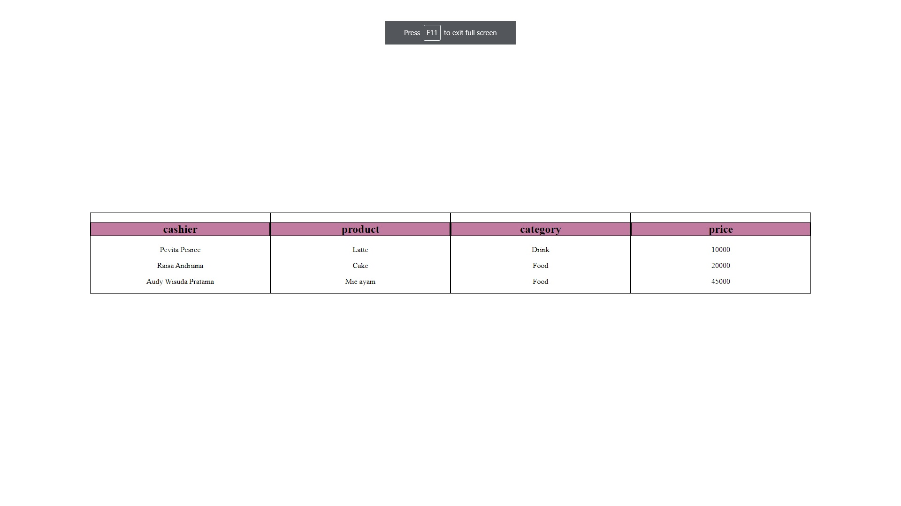
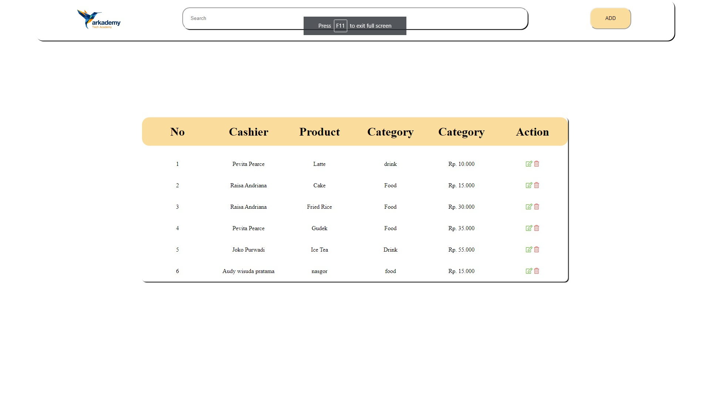
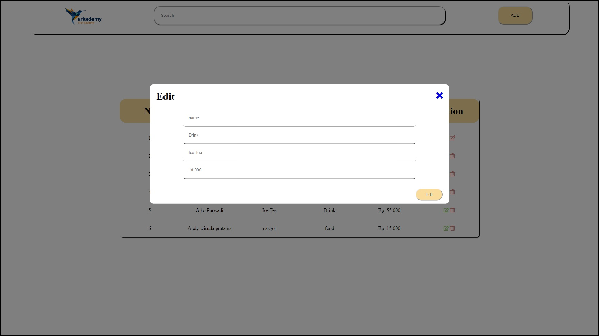
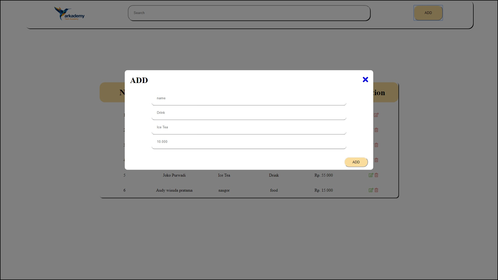
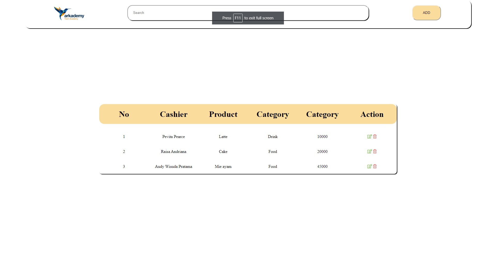

# arkademy
soal bootcamp arkademy

* bahasa yang saya gunakan adalah Javascript

* Setiap file dapat di jalankan di browser console

berikut screenshot untuk soal soal nomor 6

* 6A

* 6B
1

2

3

* 6C

